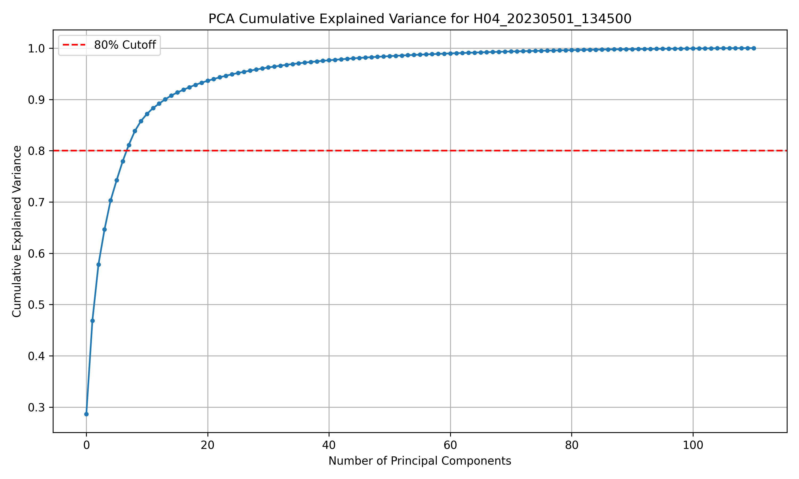
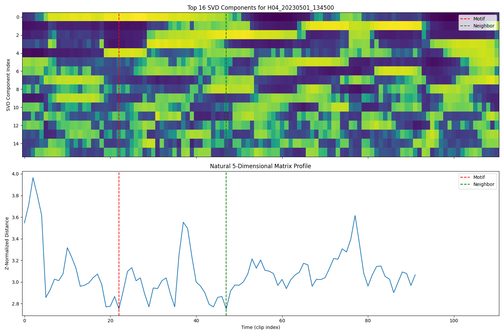
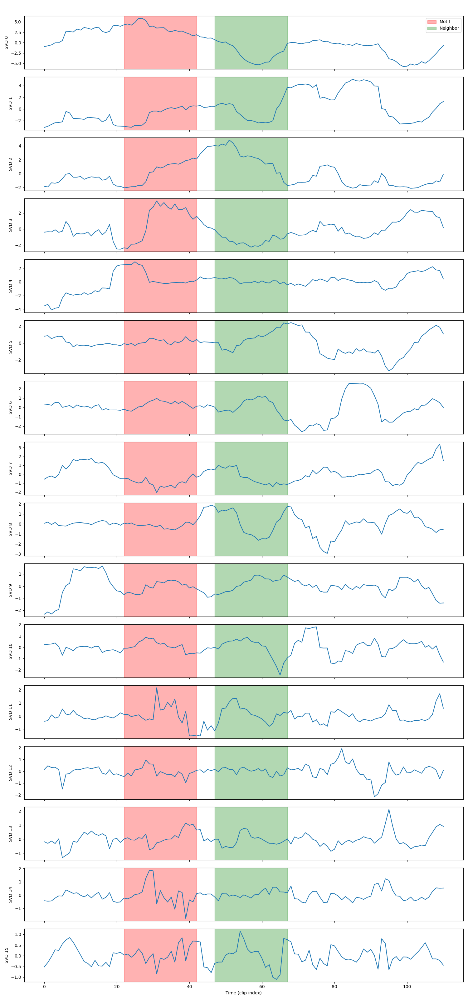
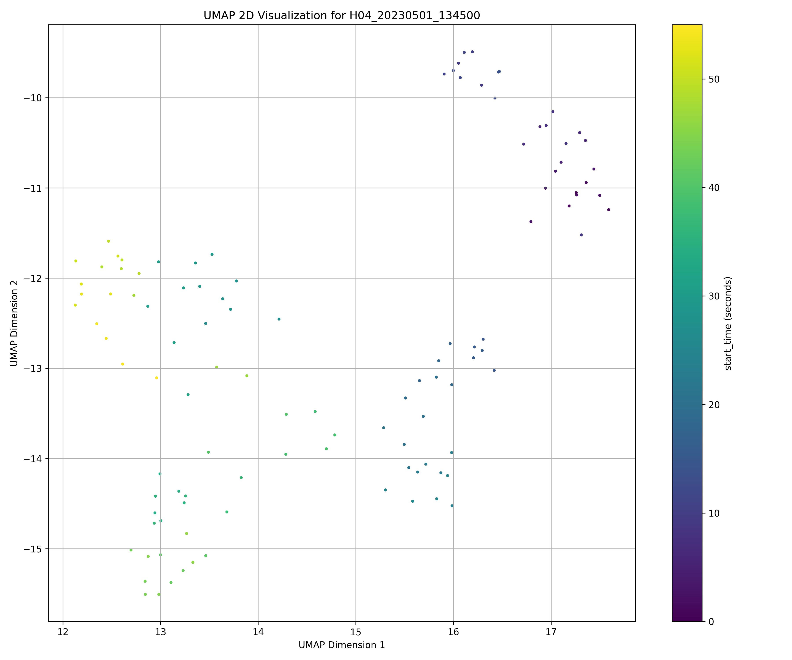
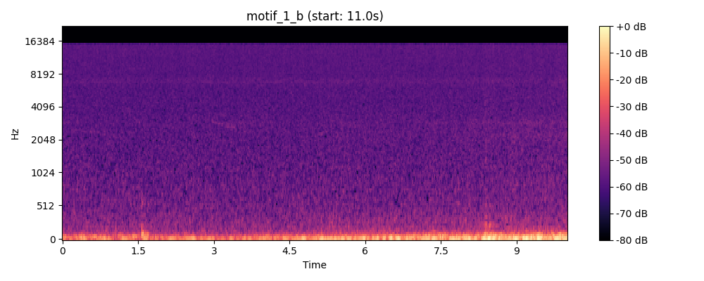

## Overview

In this report, we explore the use of domain-specific birdcall classifiers trained on the BirdSet dataset to soundscape recordings from the BirdCLEF+ 2025 competition and the MBARI Pacific Sounds dataset.
We hypothesize that we can extract unsupervised signals from soundscape embeddings that can be used to identify interesting events (animal calls) in the recordings.
We find that our unsupervised methods extract unmeaningful noise from the embeddings.
Future work should rely on parametric methods for audio representation, where features are more interpretable and controllable.

## Datasets

**Links**

* [BirdCLEF+ 2025 Competition Dataset](https://www.kaggle.com/competitions/birdclef-2025/data)
* [Pacific Sound - AWS Open Data Registry](https://registry.opendata.aws/pacific-sound/)
* [MBARI Soundscape Listening Room](https://www.mbari.org/project/soundscape-listening-room/)

The BirdCLEF+ 2025 dataset contains nearly 10,000 minutes of unlabeled soundscape recordings from El Silencio Natural Reserve in Colombia.
Each soundscape is one minute long and sampled at 44.1 kHz.
These recordings are captured with autonomous recording units (ARUs) deployed in the field, and capture birds, insects, amphibians, and mammals in their natural habitats.
This data is helpful for conservation efforts by helping effectively build an acoustic census of the area.

The MBARI Pacific Sounds dataset contains almost 10 years of underwater soundscape recordings from Monterey Bay, California.
The recordings are captured with hydrophones deployed on the seafloor sampled at 256kHz in 10-minute segments.
The listening room has the audio processed to listen at a 20 minute delay.
Animals like whales, dolphins, sea lions, and boats can be heard in the recordings.
This data is helpful for monitoring the Monterey Bay ecosystem, and tracking both animal populations and human activity in the area.

## Experiments and Exploration

**Links**

* [OpenSoundscape Documentation](https://opensoundscape.org/en/latest/)
* [Bioacoustics Model Zoo](https://github.com/kitzeslab/bioacoustics-model-zoo)
* [Distilling Spectrograms into Tokens: Fast and Lightweight Bioacoustic Classification for BirdCLEF+ 2025](https://arxiv.org/abs/2507.08236)
* [BirdSet: A Large-Scale Dataset for Audio Classification in Avian Bioacoustics](https://arxiv.org/abs/2403.10380)
* [STUMPY Documentation](https://stumpy.readthedocs.io/en/latest/)
* [Matrix Profile VI: Meaningful Multidimensional Motif Discovery](https://www.cs.ucr.edu/~eamonn/Motif_Discovery_ICDM.pdf)

We build out a pipeline to extract audio embeddings from the soundscape recordings and then apply motif discovery over a low-dimensional projection of the embeddings.
The embeddings are treated as a multivariate time series where the assumption is that a sliding window over audio embeddings will capture meaningful, repeating patterns in the audio.
We use the STUMPY library to compute the matrix profile over the embedding time series, and extract motifs and discords that we evaluate qualitatively by listening to the audio segments.
We project the high-dimensional embeddings from 1280 dimensions down to 16 dimensions to make the matrix profile computation more efficient, while preserving the structure of the data.

We use the `BirdSetEfficientNetB1` model from Bioacoustics Model Zoo trained on the BirdSet dataset.
This model uses a CNN backbone (EfficientNetB1) to classify 9,736 bird species from spectrogram inputs using a 1280-dimensional embedding layer over a 5-second audio window.
This model achieves comparable performance to Perch and BirdNET, while only relying on PyTorch (and thus being much easier to install and use).
The api is fairly straightfoward, resulting in the following schemas after processing to convert embeddings into dense vectors after sliding half-second window inference:

```
embed
 |-- file: string (nullable = true)
 |-- start_time: double (nullable = true)
 |-- end_time: double (nullable = true)
 |-- embedding: array (nullable = true)
 |    |-- element: double (containsNull = true)

predict
 |-- file: string (nullable = true)
 |-- start_time: double (nullable = true)
 |-- end_time: double (nullable = true)
 |-- predictions: array (nullable = false)
 |    |-- element: float (containsNull = true)
```

The rows look like this:

```
+-------------------+----------+--------+--------------------+
|               file|start_time|end_time|           embedding|
+-------------------+----------+--------+--------------------+
|H04_20230501_134500|       0.0|     5.0|[-0.1142078265547...|
|H04_20230501_134500|       0.5|     5.5|[-0.1127882376313...|
|H04_20230501_134500|       1.0|     6.0|[-0.0942024067044...|
|H04_20230501_134500|       1.5|     6.5|[-0.0891242176294...|
+-------------------+----------+--------+--------------------+
```

It's worth noting that while converting the arrow/parquet representations of the dense embeddings is worthwhile due to the downstream linear algebra operations, the sparsity patterns of the predictions makes a dense representation memory inefficient and hard to work with for large datasets.
In this work, we only work with embeddings, but the predictions themselves are _very_ relevant for the downstream task of identifying bird calls in soundscape recordings.

Our analysis is easier when we have fewer dimensions to work with.
We create a scree plot to identify the number of dimensions it takes to explain 80% of the variance in the data.
We find that 16 dimensions is sufficient to explain 91.4% of the variance.










