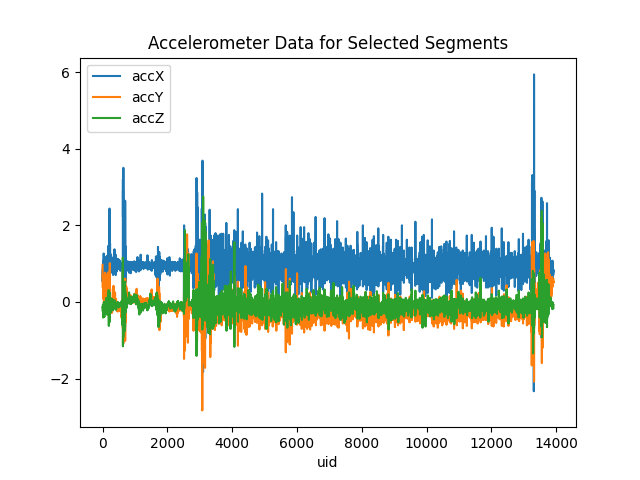

# Sensor EDA Report

- https://zenodo.org/records/13259482
- https://arxiv.org/abs/1706.03161
- https://github.com/acmiyaguchi/ai4animals/tree/main/sensor_eda

## Dataset

For this project, we use the AcTBeCalf dataset which has annoated behaviors for 30 pre-weaned calves.
They equip each calf with a 3D accelerometer sampling at 25Hz attached to a neck collar from one week to 14 weeks of age.
The X axis is top-bottom, Y is back-forward, and Z is left-right.
There are 23 annotated behaviors labeled by human observers against video footage.




## Experiment

We explore time-series clustering using TICC (Toeplitz Inverse Covariance-based Clustering) to identify patterns in the accelerometer data that correspond to different calf behaviors.
The algorithm segments time-series data into clusters based on the statistical properties of the data within sliding windows using expectation maximization (EM) and dynamic programming.
We hypothesize that we can identify distinct behaviors such as walking, running, and drinking milk based on the accelerometer data.
Using TICC, we aim to reconstruct the annotated behaviors, and then analyze the learned Markov Random Fields (MRFs) for each cluster to understand the relationships between different accelerometer features during these behaviors.

The TICC algorithm is best described in the paper, but we provide a brief overview here.
First a multi-dimensional time series is windowed in a sliding window fashion.
We assign each window into one of k clusters, which are represented by their precision matrices (inverse covariance matrices).
Once all windows are assigned, a convex solver (ADMM) is used to estimate the precision matrices enforcing a sparse Toeplitz structure that relies on local stationary assumptions.
In the maximization step, the cluster assignments are updated using dynamic programming (Viterbi algorithm) to minimize the negative log-likelihood of the data given the learned precision matrices, with a penalty for switching clusters between consecutive windows.
This is repeated until convergence.

We fork the `davidhallac/TICC` repository and modify the code so we can use it in our workflow.
The code is implemented in python and uses `numpy` and `multiprocessing` for the core computations, with `scikit-learn` for some of the initial clustering.
We add python packaging, and add JIT compilation using `numba` to speed up a few bottleneck functions.
The algorithm scales in n^3 where n is the product of the number of features and the window size.
We find the performance of the algorithm is bottlenecked by eigendecomposition and inversion of the precision matrices, which do not take advantage of the induced sparsity structure.
We'd probably see significant gains if we used a GPU to do many of the linear algebra operations, and the code actually looks like it could be adapted to use `jax` instead of `numpy`.

We construct a synthetic dataset to test the ability of TICC to recover known clusters.
In the dataset, we look for walking, running, headbutting, and drinking milk behaviors across all calves.
We randomly select 5 instances of each behavior and randomize the order of the instances to create a synthetic time series.
We run TICC on the dataset, and do a bit of hyper-parameter tuning in order to get good results.
We are four main parameters to tune: the number of clusters k, the sparsity parameter lambda, the switching penalty beta, and the window size.
We know that there are 4 behaviors, so we set this to k=4.

We set the window size to 25, which corresponds to 1 second of data at 25Hz.
We find that as the precision matrix gets higher, each iteration takes longer to run, and it becomes infeasible to run the algorithm.
At a window of 125 corresponding to 5 seconds of data, the precision matrix is 375x375, and the algorithm times out after 4 hours on an 8-core PACE instance.
We choose a smaller window of 25, which gives a 75x75 precision matrix, and gives us a total time to a solution in about 10 minutes.

We tune the sparsity parameter lambda because we found that at the default of 0.1, the precision matrices were too sparse.
For all behaviors except for running, the resulting MRFs were diagonal indicating no relationships between any of the features.
This means that the resulting model had no real interpretability, and that we were likely over-regularizing.
Pushing lambda down to 0.01 gave us MRFs that were much denser,but more interesting structure that we can intepret.


After getting structure from the MRFs, we tuned the switching penalty beta in order to get better cluster assignments.
We experimented with default values around 200, and found small incremental change (e.g. 500) didn't have too much effect.
We increased beta to 2000 and found that cluster assignments were too smooth, and that we were too aggressively penalizing switching.

In order to map the predicted cluster labels to the true behavior labels, we do two things.
First we need to truncate the original labels to match the predicted labels which are likely shorter due to the sliding window.
Second, we need to map the arbitrary cluster labels to the true behavior labels.
We do this by computing the confusion matrix between the predicted and true labels, and then using the Hungarian algorithm to find the optimal assignment of cluster labels to behavior labels.
We use standard classification metrics to evaluate the performance of the model.
To intepret the clusters, we convert the MRF into a graph using `networkx`, get a betweenness centrality score for each node, and then average the scores across sensor dimensions (x, y, z) and across time lags.

We report the results for the final experiment with k=4, lambda=0.0001, beta=1000, and window size of 25.
The time series has 13916 windows, and the cluster distribution is as follows:

behaviour | id | count
--- | --- | ---
drinking_milk | 0 | 11828
headbutt | 1 | 847
running | 2 | 517
walking | 3 | 724

The confusion matrix is as follows:

```
[[8758,   86,    0, 2984],
 [ 102,  279,  436,    6],
 [ 107,  365,   45,    0],
 [ 333,  179,  212,    0]]
```

The classification report is as follows:

```
              precision    recall  f1-score   support

           0       0.94      0.74      0.83     11828
           1       0.63      0.53      0.58       823
           2       0.40      0.71      0.51       517
           3       0.00      0.00      0.00       724

    accuracy                           0.69     13892
   macro avg       0.49      0.49      0.48     13892
weighted avg       0.85      0.69      0.76     13892
```


We find that for this particular run, we are only able to recover 69% of the true labels.
We can recover milk drinking behavior mostly beause of the higher support, but we struggle to deal with other behaviors like walking.

We use a spectral layout to visualize the MRFs for each cluster.


Milk drinking.


Walking.

We average the betweeness centrality scores across sensor dimensions.

behaviour | id | x | y | z
--- | --- | --- | --- | ---
drinking_milk | 0 | 0.0546 | 0.0375 | 0.0069
headbutt | 1 | 0.0282 | 0.0299 | 0.0203
running | 2 | 0.0730 | 0.0039 | 0.0203
walking | 3 | 0.0521 | 0.0788 | 0.0343  

In drinking milk for example, the x-axis (top-bottom) is most important, which might correspond to the head moving up and down as the calf drinks.
The results are a mixed bag, and the interpretation of some of these results are unclear especially with the low classification accuracy.

## Discussion

It was fun to play around with TICC and to see how it could be used to identify patterns in accelerometer data, especially with such a rich dataset like AcTBeCalf.
There are several limitations to the approach here.
First is that our construction of the labeled dataset doesn't necessarily reflect the true distribution of behaviors.
There are discontinuities between segments, and the distribution of time and behavior counts is not realistic.
Secondly, the hyperparameter tuning was done in a ad-hoc discovery fashion, and we could have done a more systematic search if we had more time.
However, it did take time to figure out the performance characterstics of the algorithm, and how to get experiments running in a reasonable amount of time.
Finally, it's unclear how to use TICC in a purely unsupervised setting where we don't have labels that we can use to evaluate the performance of the algorithm.

However, we were able to run TICC on some real data and show some of the network statistics from the learned MRFs.
This was also a good opportunity to get familiar with the actual workings of the TICC paper, and to see how it could be applied to real data.
I also learned quite a bit about calf behavior, and how challenging it is to annotate behaviors even with video footage.
The associated code provided by the AcTBeCalf authors was interesting to read through, as they had to deal with misaligned timestamps, and go through an extensive data cleaning process.
