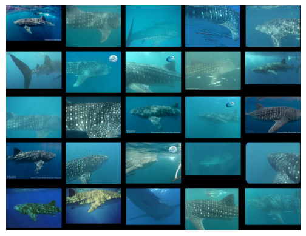
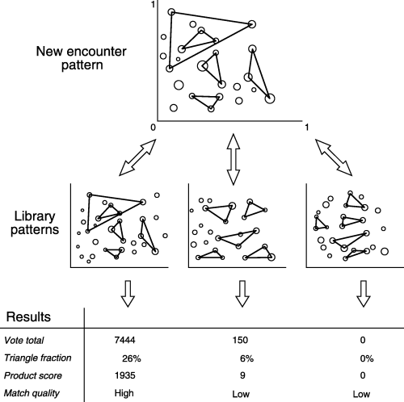
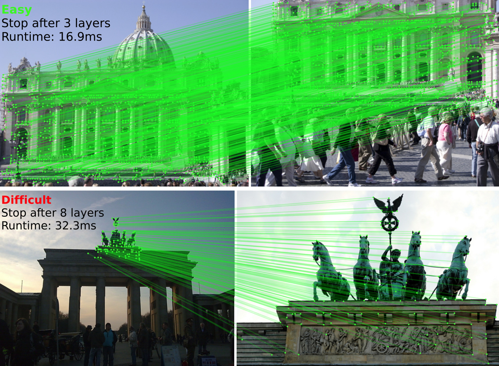

## Overview

In this exploratory data analysis, we investigate the Wildlife Datasets and Wildlife Tools repositories to explore animal re-identification.
We construct end-to-end pipelines for evaluating pre-trained re-identification models on a whale shark dataset and report our findings.

## Datasets

We focus on the Whale Shark ID dataset, which contains images of whale sharks (*Rhincodon typus*).
It is derived from 7,888 images from 2,441 encounters spanning 543 individual whale sharks, with 7,693 annotated images containing bounding boxes and individual IDs.
Whale sharks are identified by their spot patterns, which are canonically re-identified via triangle matching algorithms often used in astronomical star mapping.

| Attribute | Value |
| :--- | :--- |
| **Dataset URL** | [lila.science/datasets/whale-shark-id](https://lila.science/datasets/whale-shark-id) |
| **Primary Species** | Whale Shark |
| **Category** | Sharks |
| **Total Reported Samples** | 7,693 |
| **Identified Individuals** | 543 |
| **Data Size** | 6,466 mb |
| **Time Span** | 5.2 years |
| **Year** | 2020 |
| **Setting** | Wild |
| **Pose** | Multiple |
| **Unique Patterns** | Yes |
| **Cropped** | No |
| **From Video** | No |
| **Clear Photos** | No |
| **License** | [CDLA – Permissive 1.0](https://cdla.dev/permissive-1-0/) |
| **Citation Key** | `holmberg2009estimating` |
| **Publication** | [Link to Abstract](https://www.int-res.com/abstracts/esr/v7/n1/p39-53/) |

### Links

* [Wildlife-datasets GitHub Repository](https://github.com/WildlifeDatasets/wildlife-datasets)
* [Wildlife-datasets Documentation Home](https://wildlifedatasets.github.io/wildlife-datasets/)
* [WhaleSharkID Dataset Documentation](https://wildlifedatasets.github.io/wildlife-datasets/datasets/#whalesharkid)
* [LILA Science: Whale Shark ID Dataset](https://lila.science/datasets/whale-shark-id/)
* [A Non-Invasive Technique for Identifying Individual Whale Sharks (*Rhincodon typus*)](https://besjournals.onlinelibrary.wiley.com/doi/full/10.1111/j.1365-2664.2005.01117.x)
* [Photo-Identification of Individual Whale Sharks (*Rhincodon typus*)](https://www.int-res.com/articles/esr2009/7/n007p039.pdf)

## Experiments and Exploration

Our main experiment evaluates an open-set re-identification problem on the WhaleSharkID dataset.
We split the dataset into train, calibration, and test sets with 60/20/20 proportions based on individuals.
We then use the `wildlife-tools` library to implement an inference pipeline using k-Nearest Neighbors (KNN) on global features and WildFusion on a combination of global and local features.

We are able to run a full inference pipeline on the global features and KNN within 5 minutes on an NVIDIA 1080 Ti GPU. This is achieved by extracting embeddings for a ViT model in a single pass, then performing KNN via FAISS on the CPU.
The WildFusion pipeline with local feature extraction via LightGlue takes a projected 29 hours to complete, as it requires pairwise local feature matching between each query and training image.
The number of candidate pairs is reduced by filtering with global features first, but it remains a computationally expensive process to match local features in pairs of images due to both the combinatorial explosion of pairs and the complexity of the transformer model used in LightGlue.

Given the computational constraints, we limit the number of individuals to the 30 most frequently occurring individuals in the dataset and limit the number of training images per individual to 3.
This helps set a constant budget of pairwise comparisons needed for the local feature matching step and places the KNN and WildFusion pipelines on a more equal footing.
We report the configurations for each of our experiments.
For KNN, we vary the number of neighbors considered (1, 3, 5, 10) and the global feature extractor (CLIP-ViT-B32, DINOv2-S14, MegaDescriptor-Tiny).
We use cosine similarity for all KNN experiments.
CLIP is a multimodal model trained on image-text pairs, DINOv2 is a self-supervised vision transformer trained on a large corpus of images, and MegaDescriptor is a model specifically trained for animal re-identification using Swin Transformers.
For WildFusion, we use MegaDescriptor-Tiny as the global feature extractor and various settings for the local feature extractor matched using LightGlue (SIFT, SuperPoint, DISK).

Table: Comparison of open-set re-identification pipelines. A max of 30 individuals and 3 images per individual are used. KNN is used with cosine similarity on global features. WildFusion uses LightGlue with local feature extraction (LG) and the global feature extractor to reduce computation in pairwise comparisons. The budget parameter is set to 20.

| Pipeline | Model / Config | k | Acc | ECE |
| :--- | :--- | ---: | ---: | ---: |
| knn | MegaDesc-T | 1 | 21.11% | 1.96% |
| knn | CLIP-ViT-B32 | 3 | 20.00% | 1.67% |
| knn | MegaDesc-T | 3 | 20.00% | 1.96% |
| knn | CLIP-ViT-B32 | 1 | 20.00% | 1.67% |
| wildfusion | MegaDesc-T + Disk-LG | 1 | 17.78% | 1.15% |
| knn | CLIP-ViT-B32 | 5 | 16.67% | 1.67% |
| knn | MegaDesc-T | 5 | 14.44% | 1.96% |
| knn | MegaDesc-T | 10 | 13.33% | 1.96% |
| wildfusion | MegaDesc-T + SP-LG | 1 | 13.33% | 1.53% |
| knn | CLIP-ViT-B32 | 10 | 12.22% | 1.67% |
| knn | DINOv2-S14 | 3 | 12.22% | 1.91% |
| wildfusion | MegaDesc-T + SIFT-LG | 1 | 12.22% | 1.49% |
| knn | DINOv2-S14 | 5 | 10.00% | 1.91% |
| knn | DINOv2-S14 | 1 | 10.00% | 1.91% |
| knn | DINOv2-S14 | 10 | 7.78% | 1.91% |

Table: Accuracy for WhaleSharkID dataset from the WildFusion paper.

| Model | Accuracy | Delta |
| :--- | ---: | ---: |
| MegaDescriptor Large-384 | 62.04% | - |
| WildFusion (all) | 80.33% | +18.28% |
| WildFusion (local) | 77.68 | +15.64% |

We compare this result to the scores in the WildFusion paper for the WhaleSharkID dataset.
The difference in performance is unexpectedly large, but not entirely unsurprising given the limited computational budget set for this experiment.
The MegaDescriptor Tiny-224 model we used is a 28.3M parameter model based on Swin-T, while the MegaDescriptor Large-384 is a 228.8M parameter model based on Swin-L.
This represents an order of magnitude difference in model size and the ability to discriminate between individuals.
Additionally, the comparison is not entirely fair, as we do not share the same train/calibration/test splits and number of individuals used by the authors.
However, this highlights that more computation and larger models are likely necessary to achieve strong performance.

### Links

* [Wildlife-tools Documentation](https://wildlifedatasets.github.io/wildlife-tools/)
* [SuperPoint: Self-Supervised Interest Point Detection and Description](https://arxiv.org/abs/1712.07629)
* [LightGlue GitHub Repository](https://github.com/cvg/LightGlue)
* [WildFusion: Individual Animal Identification with Calibrated Similarity Fusion](https://arxiv.org/abs/2408.12934v1)
* [DISK: Learning Superpixel-based Discriminative Keypoints](https://arxiv.org/abs/2006.13566)
* [MegaDescriptor: A Foundation Model for Animal Re-Identification](https://arxiv.org/abs/2311.09118)
* [CLIP: Learning Transferable Visual Models From Natural Language Supervision](https://arxiv.org/abs/2103.00020)
* [DINOv2: Learning Robust Visual Features without Supervision](https://arxiv.org/abs/2304.07193)
* [Swin Transformer: Hierarchical Vision Transformer using Shifted Windows](https://arxiv.org/abs/2103.14030)
* [Efficient LoFTR: Semi-Dense Local Feature Matching with Sparse-Like Speed](https://zju3dv.github.io/efficientloftr/)

## Discussion and Future Work

We initially started using a closed-set re-identification approach, which can be implemented with a standard training and test split.
This is amenable to standard classification models, as each individual is treated as its own class.
However, this was not realistic for a real-world re-identification scenario, so we pivoted to an open-set approach.
The `wildlife-datasets` library provides an interesting suite of splits based on identities (closed-set, open-set, disjoint-set) and time (time-proportion, time-cutoff, random) that could be explored further.
I am curious about which applications and animals the temporal splits would be most useful for.

It would be beneficial to reimplement the entire WildFusion pipeline, which included aggregating over many local feature extractors and global feature extractors.
However, looking through the codebase, I expect there are engineering improvements that could speed up comparisons considerably.
In order to narrow down candidate pairs for local feature matching, the WildFusion implementation in `wildlife-tools` uses a brute-force approach to find the top-K nearest neighbors for each query image in the global feature space.
This should instead be done with an approximate nearest neighbor search library to go from O(N*M*D) to O(N*D*log(M)), where N is the number of query images, M is the number of training images, and D is the feature dimension.
It is also possible that LightGlue itself is too slow for older GPUs, as the progress bar indicated the total number of pairwise comparisons needed.
One such improvement would be to use a faster matcher such as Efficient LoFTR, which is 3x faster than LightGlue in a sparse matching setting.

Finally, there are many different re-identification models in the `wildlife-datasets` library.
It would be interesting to investigate more of them, especially for animals where geometry is more important than texture, to see how different families of models perform.
We examined a few different global feature extractors, and they seemed to rank as expected.
The MegaDescriptor model was trained specifically for animal re-identification and performs the best.
CLIP is not far behind, and it has been observed that having multimodal training data helps learn representations better (similar to DeepSeek optical compression, i.e., a vision token is worth 10-20 text tokens).
The DINOv2 model lags behind both, which is expected as it is not particularly focused on learning specific fine-grained features like keypoints or patterns, which are important for re-identification.
In general, are there ways to exploit domain knowledge about animal patterns and shapes to help improve re-identification performance in the age of large foundation models?
